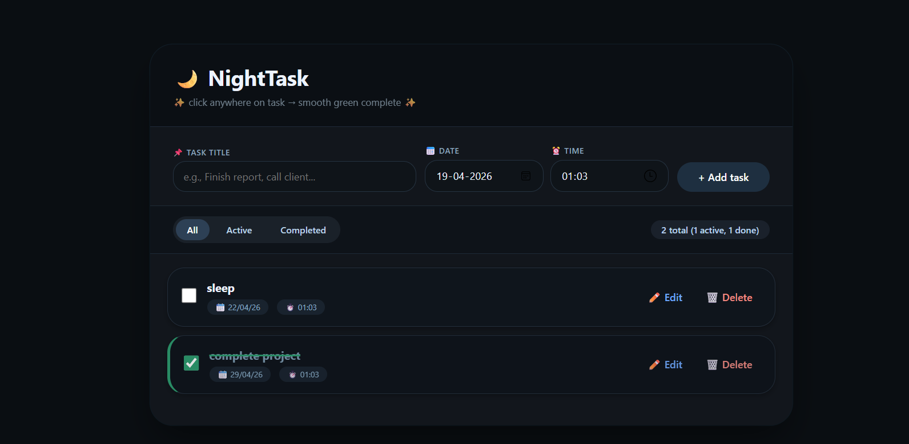

# ✅ TaskFlow – To-Do Web App


---

## 📌 Overview

**TaskFlow** is a modern, dark-themed **To-Do Web Application** developed during my **Web Development Internship at SkillCraft Technology**.

📂 **Task:** SCT_WD_4  
🎯 Focus: Task management with clean UI, smooth UX, and persistent storage.

This application helps users efficiently manage daily tasks with features like creation, editing, filtering, and scheduling.

---

## 🖼️ App Interface

---

## 🎯 Features

- ✅ Add tasks with **title, date & time**
- ✅ Mark tasks as complete with **smooth green animation**
- ✅ Edit tasks using a **modal dialog**
- ✅ Delete tasks with **confirmation prompt**
- ✅ Filter tasks (**All / Active / Completed**)
- ✅ Automatic **sorting by date & time**
- ✅ 📊 Real-time **task counter**
- ✅ 🌙 Clean **dark theme UI**
- ✅ 📱 Fully **responsive design**
- ✅ 💾 Data stored using **localStorage**

---

## 🛠️ Tech Stack

| Technology   | Usage                          |
|-------------|--------------------------------|
| HTML5       | Structure                      |
| CSS3        | Styling, animations, UI design |
| JavaScript  | Logic, DOM, LocalStorage       |

---

## 🚀 Run Locally

```bash
# Clone the repository
git clone https://github.com/ksakshay2004-lang/SCT_WD_4.git

# Navigate into the folder
cd SCT_WD_4

# Open in browser
open index.html

📂 Project Structure
SCT_WD_4/
│
├── index.html
├── README.md
│
└── appinterface.png
     
👨‍💻 Author

Akshay K S

📧 Email: ksakshay2004@gmail.com

🔗 GitHub: https://github.com/ksakshay2004-lang

⭐ Acknowledgment

This project was built as part of the SkillCraft Technology Internship Program.
